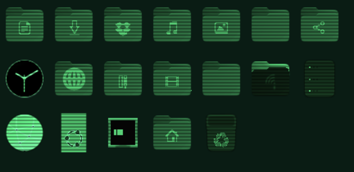
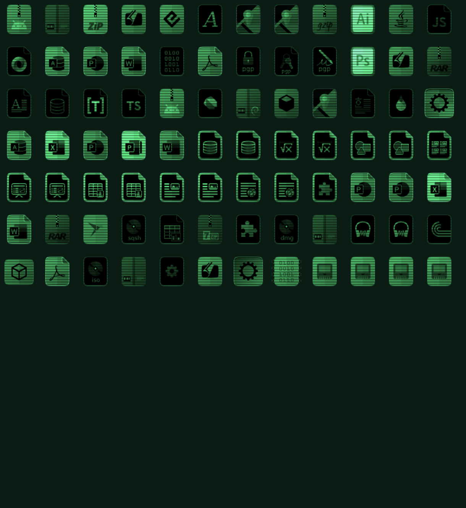
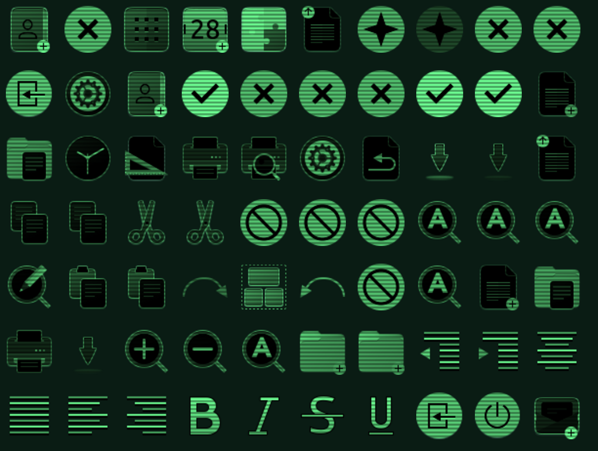

# Cathode Phosphor Icon Theme

A green phosphor CRT-style icon theme for GNOME, inspired by retro terminal aesthetics. Built as a derivative of Ubuntu's [Yaru](https://github.com/ubuntu/yaru) icon set. Intended for use in retro Phosphorous Terminal Style themes, like [RobCo](https://github.com/signaldirective/robco-theme) and [PhosphorOS](https://omarchythemes.com/themes/phosphor-os). 


## Features

- Green phosphor monochrome treatment across all icon categories
- Scanline overlay effect for CRT authenticity
- Custom-drawn folder emblems, terminal-style desktop icon, and globe network icon
- Full coverage: places, mimetypes, actions, apps, devices, and status icons
- HiDPI (@2x) support at all sizes

## Install

### Omarchy

```bash
omarchy-pkg-aur-add cathode-phosphor-icon-theme-git
gsettings set org.gnome.desktop.interface icon-theme 'cathode-phosphor'
```

### Arch Linux (AUR)

```bash
yay -S cathode-phosphor-icon-theme-git
gsettings set org.gnome.desktop.interface icon-theme 'cathode-phosphor'
```

### Manual

```bash
git clone https://github.com/peteonrails/cathode-phosphor-icon-theme.git
cp -r cathode-phosphor-icon-theme/cathode-phosphor ~/.local/share/icons/
gtk-update-icon-cache ~/.local/share/icons/cathode-phosphor
gsettings set org.gnome.desktop.interface icon-theme 'cathode-phosphor'
```

The theme inherits from `Yaru-dark` and `hicolor`, so install Yaru if you want fallback coverage for any icons not included in this set.

## Build from source

The build script transforms Yaru source icons using ImageMagick. Requires:

- [ImageMagick](https://imagemagick.org/) (v7+)
- Yaru icons installed at `/usr/share/icons/Yaru`

```bash
./build.sh
```

## Gallery

| Places | Mimetypes | Actions |
|--------|-----------|---------|
|  |  |  |

## Credits

- [Yaru Icons](https://github.com/ubuntu/yaru) by Sam Hewitt, Matthieu James, and the Canonical Design Team
- [Signal Directive](https://github.com/SignalDirective) for the RobCo omarchy theme that inspired this icon set
- [OldJobobo](https://github.com/OldJobobo) for the [Phosphor OS](https://omarchythemes.com/) omarchy theme
- Bethesda Softworks, whose Fallout series inspired the CRT phosphor aesthetic

## License

Creative Commons Attribution-Share Alike 4.0 International. See [LICENSE](LICENSE).
